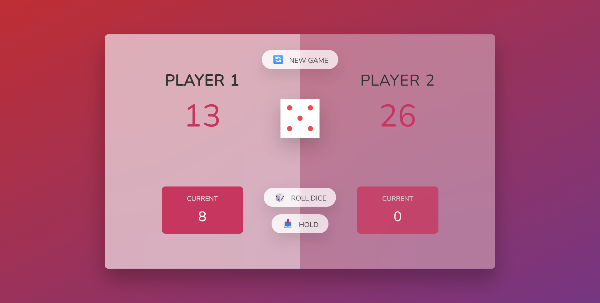

# 🎲 Pig Game 🎯  
A fun two-player dice game built with HTML, CSS, and JavaScript.

---

🔹 **Description**  
Race to 100 points in this classic two-player dice game!  
Players roll the dice to accumulate points, but rolling a **1** ends your turn and resets your current round score.  
The first player to reach **100 points** is crowned the winner 🏆.  

---

### Features
- 🎲 Random dice rolls with dice image updates (`./assets/dice-N.png`)  
- 🧮 Player score tracking (current & total)  
- 🔄 Reset functionality with New Game button  
- 👥 Active player highlighting with transitions  
- 🏆 Winner state with styled announcement  
- Clean, modular JavaScript code (`init`, `switchPlayer`, `updateScores`, `checkWinner`)  
- Glassmorphism-inspired UI with frosted blur effect  

---

📸 **Screenshots & Flowchart**  
  

---

🔹 **Live Preview**  
🔗 [Play Pig Game](https://imissh3r.github.io/pig-game/)  

---

🔹 **Built With**
- HTML  
- CSS (glassmorphism, transitions, layout)  
- JavaScript (event handling, game logic, DOM updates)  

---

🔹 **Author**  
GitHub: [@Imissh3r](https://github.com/Imissh3r)  
Project Repo: [pig-game](https://github.com/Imissh3r/pig-game)

---

🔹 **Acknowledgements**  
This project was created while following  
[The Complete JavaScript Course 2025: From Zero to Expert!](https://www.udemy.com/course/the-complete-javascript-course/)  
by **Jonas Schmedtmann**.  
